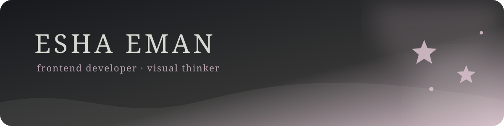
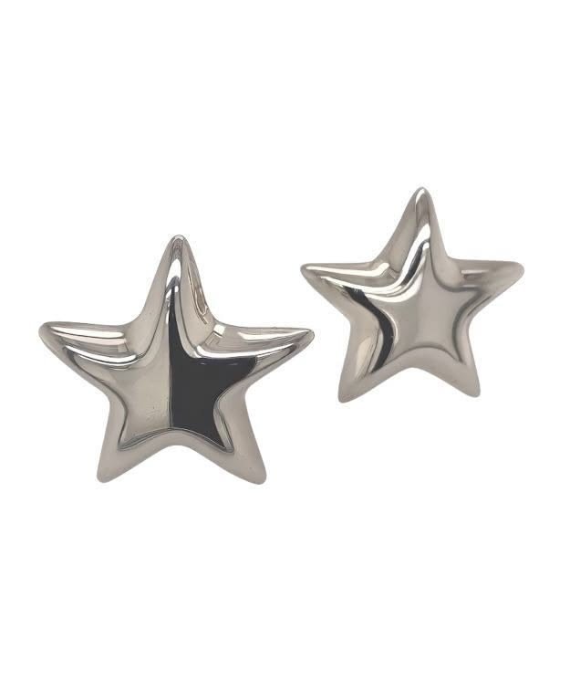
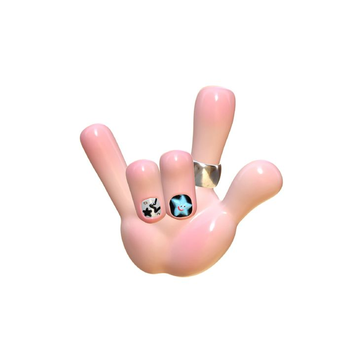
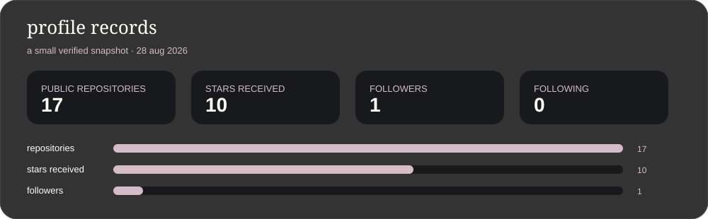

  
    
  
<strong>software engineering student · frontend developer · UI/UX designer</strong>

  
building soft interfaces with sharp edges — useful products, expressive visuals, and code that stays human.

 

<table width="100%" border="0">
  <tr>
    <td width="33%" align="center"></td>
    <td width="34%" align="center">
      <h2>hello, i'm esha ✦</h2>
      
<em>code · design · curiosity</em>

      
I like making digital spaces feel clear, expressive, and a little unexpected — thoughtful interfaces backed by practical code.

    </td>
    <td width="33%" align="center"></td>
  </tr>
</table>

my visual north star: graphite, milk, soft lilac, chrome details, and just enough weirdness.

## currently in the studio

- sharpening front-end fundamentals with modern JavaScript, CSS, and React
- exploring backend foundations in Python and Java, plus cloud and AI concepts
- shaping UI/UX case studies in Figma and building more human-centered interfaces
- looking for opportunities where software, design, and problem-solving overlap

## selected work

<table width="100%">
  <tr>
    <td width="50%" valign="top">
      <h3> <a href="https://github.com/eshaeman003/taxnet-AI">taxnet-AI</a> explore</h3>
      
Knowledge graphs, entity resolution, GovTech, and explainable AI for detecting lifestyle-income gaps.

      Python · AI · hackathon project
    </td>
    <td width="50%" valign="top">
      <h3> <a href="https://github.com/eshaeman003/health-checking-app">health-checking-app</a> explore</h3>
      
A supportive interface for reflecting on sleep, energy, mood, and when to ask for help.

      TypeScript · wellness interface
    </td>
  </tr>
  <tr>
    <td width="50%" valign="top">
      <h3> <a href="https://github.com/eshaeman003/connect-four-game-project">connect-four-game-project</a> explore</h3>
      
An AI-focused semester project built around the classic game.

      AI · group project · game logic
    </td>
    <td width="50%" valign="top">
      <h3> <a href="https://github.com/eshaeman003/figma-projects">figma-projects</a> explore</h3>
      
Interface studies from HCI and computer graphics coursework.

      Figma · HCI · visual design
    </td>
  </tr>
</table>

## toolbox

  

## the data, but make it soft

  

GitHub's native contribution graph still lives on the profile overview; this README's chart is hosted inside the repository so it renders reliably.

## say hi

  <a href="https://www.linkedin.com/in/esha-eman-2133b535a/">LinkedIn</a> ·
  <a href="mailto:eshaeman003@gmail.com">Email</a> ·
  <a href="https://github.com/eshaeman003?tab=repositories">Explore my repositories</a>

 

